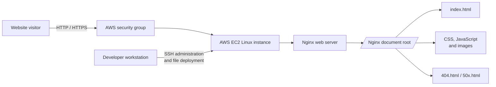

# Linux Web Server & Nginx Deployment

This project is a static **StackCraft developer portfolio** deployed to an AWS EC2 Linux server and served by Nginx. It demonstrates the complete path from remotely accessing a Linux host to publishing browser-ready HTML, CSS, JavaScript, and image assets over the web.

The project is intentionally server-focused: there is no backend application, database, package manager, or build step. Nginx delivers the files directly from its web root.

## Architecture



### Request flow

1. A visitor requests the public EC2 address.
2. The AWS security group allows the configured web traffic, normally ports `80` and/or `443`.
3. Nginx receives the request and serves files from its configured document root.
4. The browser loads `index.html`, its stylesheet, JavaScript, and images.
5. Nginx uses the included error pages when a resource is missing or the server returns an upstream error.

## Features of the site

- Responsive single-page portfolio layout
- About, skills, projects, experience, and contact sections
- Mobile navigation, scroll effects, active-section highlighting, and reveal animations
- Custom Nginx `404` and `50x` error pages
- Local image assets for the portfolio content
- External Google Fonts loaded by the browser

## Technology

- AWS EC2
- Linux
- Nginx
- SSH
- HTML5
- CSS3
- Vanilla JavaScript

## Repository structure

```text
.
├── index.html                         # Main StackCraft portfolio page
├── tooplate-stackcraft-style.css      # Layout, responsive styles, and animations
├── tooplate-stackcraft-script.js      # Navigation and scroll interactions
├── images/
│   ├── about.jpg                      # About-section image
│   └── project-{1..4}.jpg             # Project cards
├── 404.html                           # Nginx missing-page response
├── 50x.html                           # Nginx server-error response
├── nginx-logo.png                     # Logo used by the error pages
├── timer.html                         # Redirect page to TimerMo
├── LICENSE
└── README.md
```

## Deployment

The exact package and service commands depend on the Linux distribution. The following example uses an Ubuntu/Debian-style EC2 instance:

```bash
# Connect to the instance
ssh -i /path/to/key.pem ubuntu@<EC2_PUBLIC_IP>

# Install and enable Nginx
sudo apt update
sudo apt install -y nginx
sudo systemctl enable --now nginx

# Copy the site from a workstation (run locally)
rsync -avz --delete -e "ssh -i /path/to/key.pem" \
  ./ ubuntu@<EC2_PUBLIC_IP>:/tmp/stackcraft-site/

# Install the files in Nginx's web root (run on the instance)
sudo cp -r /tmp/stackcraft-site/. /var/www/html/
sudo chown -R www-data:www-data /var/www/html
sudo find /var/www/html -type f -exec chmod 644 {} \;
sudo find /var/www/html -type d -exec chmod 755 {} \;

# Validate configuration and verify the service
sudo nginx -t
sudo systemctl status nginx
curl -I http://localhost
```

For Amazon Linux, use the appropriate `ec2-user`, package manager, and Nginx user for that distribution. Configure the EC2 security group to allow the web ports required by the deployment, and restrict SSH access to trusted IP addresses.

## Local preview

Because this is a static site, it can be previewed without Nginx:

```bash
python3 -m http.server 8000
```

Then open <http://localhost:8000> in a browser. This previews the site only; it does not reproduce the EC2 security group or Nginx configuration.

## Verification checklist

- `sudo nginx -t` reports a valid configuration.
- `sudo systemctl is-active nginx` returns `active`.
- `curl -I http://localhost` returns an HTTP response.
- The EC2 public address loads `index.html` from an external browser.
- A missing path displays `404.html` when the Nginx configuration maps that error page.
- The browser console contains no missing local asset errors.

## Credits

The portfolio layout is based on the Tooplate StackCraft template. See the repository `LICENSE` for licensing details.
